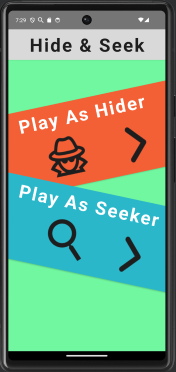
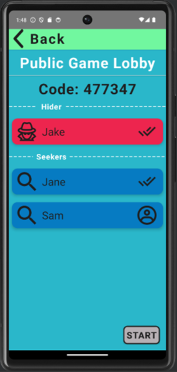
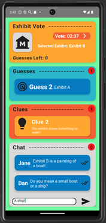
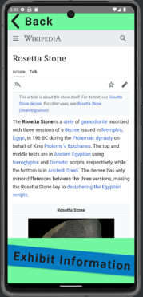

# Museum Hide and Seek

Museum Hide and Seek is a multiplayer mobile application that gamifies museum exploration through a collaborative hide-and-seek game. The app aims to create an engaging and educational experience for users.

---

## Features

### **Core Gameplay**
- **Hider Role (Located anywhere):**
  - Play from any location.
  - Select a museum exhibit to “hide” at.
  - Provide clues intermittently to help Seekers find the exhibit.
- **Seeker Role (Located at the Museum):**
  - Play from the museum.
  - Collaborate with other Seekers to explore exhibits and deduce the Hider’s location.
  - Use the clues provided and vote on the exhibit you believe the Hider is hiding at.
- **Winning Conditions:**
  - **Everyone Wins:** If the Seekers correctly guess the exhibit within the allotted time.
  - **Everyone Loses:** If the Seekers fail to guess correctly before the timer expires.

### **Game Modes**
- **Public and Private Lobbies:**
  - Join public games with other players.
  - Create private games for friends using a unique lobby code.

### **Real-Time Interaction**
- **In-game chat** for seamless collaboration.
- **Notifications** to keep players informed about new clues, guesses, and game updates.

### **Educational Value**
- **Hiders:** Learn about museum exhibits while selecting and hiding.
- **Seekers:** Explore the museum physically, using the provided clues to discover exhibits.
- Both roles gain insights into museum collections while engaging in a collaborative game.

---

## Screenshots

### **Main Menu**


### **Game Lobby**


### **Gameplay**


### **Exhibit Information**


### **Victory and Defeat Screens**


---

## Technical Overview

### **Technologies Used**
- **Android Studio**: Java-based development environment.
- **Firebase Firestore**: Real-time database for syncing user and game data.
- **RecyclerView**: Efficient UI for dynamic lists.
- **Web Viewer**: Integrated exhibit information access.

---

## Installation

1. Clone this repository:
   ```bash
   git clone https://github.com/yourusername/MuseumHideAndSeek.git
   ```
2. Open the project in Android Studio.
3. Set up your Firebase Firestore:
   - Add your `google-services.json` file in the `app/` directory.
4. Build and run the app on an Android device.

---

## Credits & Contact

Developed by Nadan Liddar

For questions or feedback, please reach out to nliddar@gmail.com
